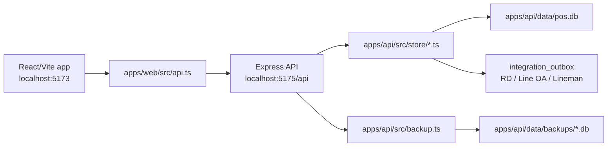

---
tags:
  - secondbrain
  - architecture
updated: 2026-04-26
---

# Architecture

## Shape

## Frontend

The frontend now uses router pages and contexts.

Core providers:

- `AuthContext`: PIN login and JWT/localStorage session.
- `BranchContext`: Auth-aware branch loading and selected branch.
- `ShiftContext`: current shift per branch.
- `CartContext`: branch-bound cart, stacked discount rules, loyalty point redemption, and checkout.

Routes:

- `/login`
- `/branch`
- `/dashboard`
- `/pos`
- `/inventory`
- `/staff`
- `/reports`
- `/migration`
- `/settings`

Supporting frontend files:

- `api.ts`: wraps `fetch`, attaches `Authorization: Bearer <token>`, and maps UI calls to API endpoints.
- `types.ts`: shared frontend domain shapes.
- `styles.css`: design-system and screen styling.

## Backend

The API has three practical layers:

- `apps/api/src/index.ts`: HTTP routes, payload parsing, request validation.
- `apps/api/src/middleware/auth.ts`: JWT Auth middleware.
- `apps/api/src/store/*.ts`: SQLite query/mutation modules.

On startup, `apps/api/src/db.ts` opens `apps/api/data/pos.db`, enables WAL mode and foreign keys, creates schema if needed, and seeds Big B Coffee / oil service data when empty.

## Data Persistence

Persistence is SQLite via `better-sqlite3`. Auto-backup runs from `apps/api/src/backup.ts`, creates verified `.db` snapshots, and prunes old backups by retention count.

Integration work is modeled as an outbox table in SQLite. Orders enqueue provider-specific payloads for RD/e-Tax, Line OA, and Lineman; live provider delivery is intentionally a later step.

## Design Direction

Root `DESIGN.md` says this should feel like a dense operational POS/back-office tool: Thai-heavy UI, fast scanning, visible branch context, stock visibility, and no marketing hero treatment.
